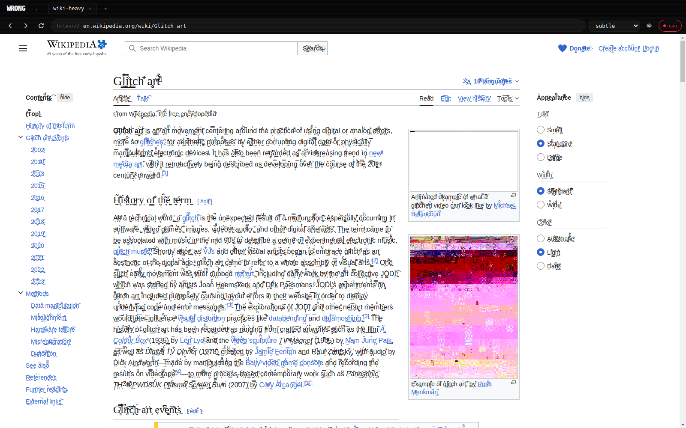
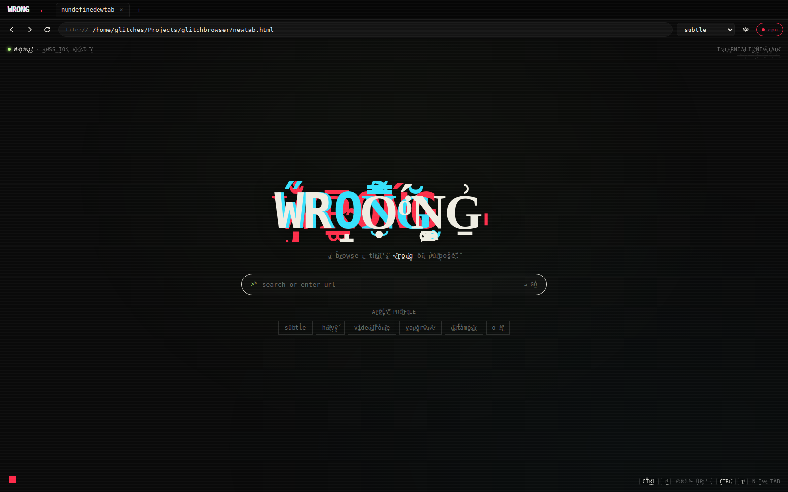
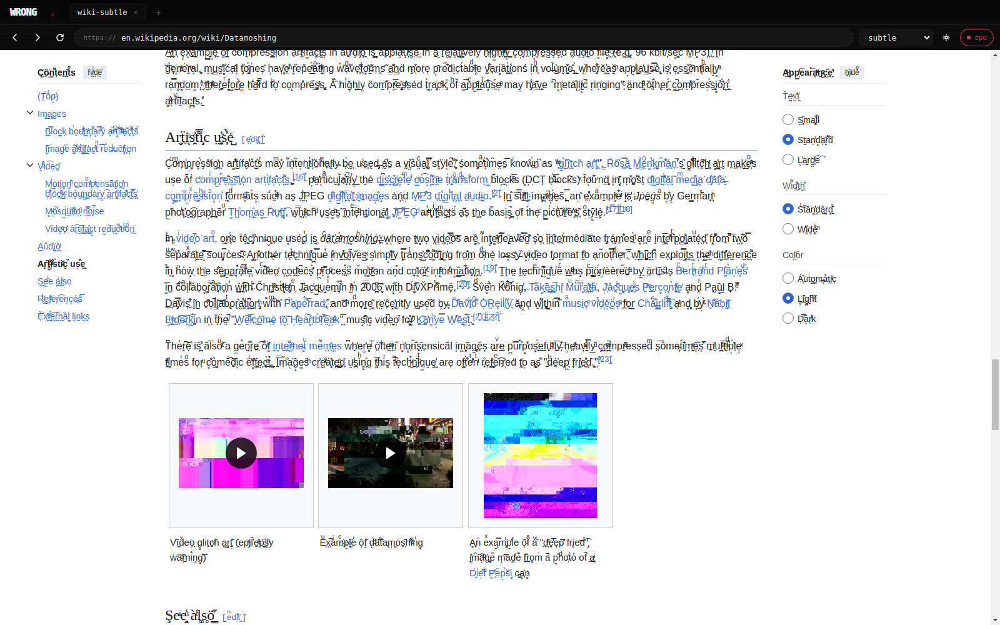
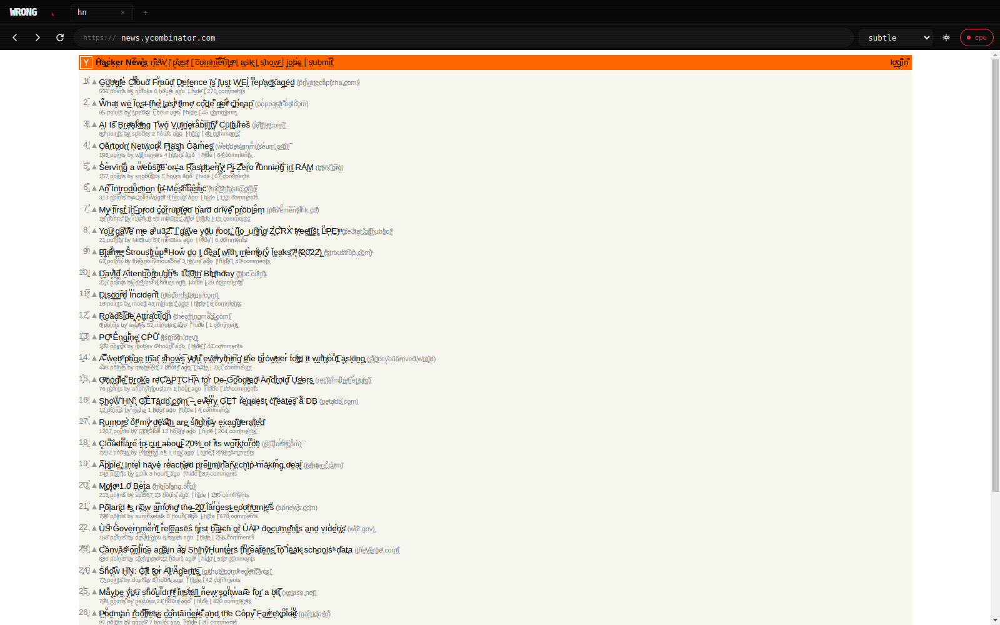

# WRONG

> a browser that's wrong on purpose



[](./LICENSE)
[](https://github.com/willbearfruits/wrong/releases)
[](https://github.com/willbearfruits/wrong/releases)
[](https://github.com/willbearfruits/wrong/releases)
[](https://github.com/willbearfruits/wrong/stargazers)

WRONG is an Electron-based web browser that **deliberately corrupts what it shows you**. It byte-flips JPEG/PNG/WebP/GIF responses before the decoder sees them. It pierces shadow DOMs and pours combining diacritics into every visible character. It datamoshes video on the fly with block-matched motion warping. It is not a productivity tool. It is the browser equivalent of a malfunctioning television.

This is glitch art as an everyday browsing surface. The artefacts you see are real decoder failures, not painted-on filters — corruption is injected at the byte level (image responses) and the frame level (decoded video pixels), exactly where genuine glitches live.

**Live site & downloads:** [willbearfruits.github.io/wrong](https://willbearfruits.github.io/wrong/)

---

## table of contents

- [download](#download)
- [what it does](#what-it-does)
- [features](#features)
- [philosophy](#philosophy)
- [run from source](#run-from-source)
- [build a local AppImage](#build-a-local-appimage)
- [controls](#controls)
- [what it doesn't do](#what-it-doesnt-do)
- [tech](#tech)
- [contributing](#contributing)
- [license](#license)

## download

From the [Releases](https://github.com/willbearfruits/wrong/releases) page:

| os | file | size |
|---|---|---|
| **Linux x86_64** | `WRONG-0.2.1.AppImage` | ~103 MB |
| **Windows x64 installer** | `WRONG-Setup-0.2.1.exe` | ~80 MB |
| **Windows x64 portable** | `WRONG-0.2.1.exe` | ~80 MB |

### Linux

```bash
chmod +x WRONG-0.2.1.AppImage
./WRONG-0.2.1.AppImage
```

### Windows

SmartScreen will show "Unrecognized app" because the build is unsigned. Click **More info → Run anyway**. Then either run the installer (Start menu shortcut + uninstaller) or just double-click the portable `.exe`.

Settings live in your platform's standard app-data directory (`~/.config/WRONG/` on Linux, `%APPDATA%\WRONG\` on Windows).

## what it does

### a real new tab page



Every new tab opens an internal page with the wordmark, a unified search/URL bar, and one-click profile presets — `subtle / heavy / videodrome / vaporwave / datamosh / off`. Clicking a chip immediately reconfigures the active glitch state.

### subtle vs heavy on the same article


*Wikipedia at intensity 0.004, zalgo 0.25*


*Wikipedia at intensity 0.018, zalgo 0.7 — note the partial JPEG decode in the lower right*

The image corruption is real codec damage, not a CSS filter. JPEG bytes are flipped between the SOS marker and EOI (where the entropy-coded scan data lives), with byte-stuffing preserved so the decoder still finds its way through. Result: the partial-render artefacts that come from confused real decoders, not painted-on noise.

### text-heavy sites



Zalgo walks every text node — including across shadow-DOM boundaries (custom elements on YouTube etc.) — via TreeWalker plus a per-shadow-root MutationObserver and a periodic poll for late-attaching shadow roots.

## features

- **byte mangling** — `session.protocol.handle()` intercepts every image/audio/video response. Format-aware: JPEG SOS-marker-aware, PNG IDAT with CRC32 recompute, WebP / GIF / MP4 / WebM container-skip. Slider 0–0.2.
- **zalgo** — preload walks the entire DOM (including open shadow roots; periodic poll catches custom elements that attach roots after upgrade). MutationObserver per shadow root for live content.
- **datamosh** — for each playing `<video>`, an overlaid `<canvas>` does block-matched motion estimation (32×32 blocks, ±6 px search, sub-sampled SAD) on each frame, warps a persistent carrier buffer by the motion field, and refreshes a small percentage from the new frame. Old pixels ride new motion. Crash-free at any intensity because the codec never sees corrupted bytes.
- **css filters** — chromatic, scanlines, invert, hue-shift, vhs (SVG turbulence + displacement). Page-wide.
- **profile presets** — `subtle / heavy / videodrome / vaporwave / datamosh / off`. One click sets all parameters.
- **gpu / cpu rendering** — the toggle restarts the app with `--disable-gpu`. Software rasteriser produces visibly different artefacts on transforms and filters than the GPU pipeline.

## philosophy

Most "glitch" tools work by overlaying effects on top of clean media — chromatic aberration, scanlines, posterise. They look like effects, because they are. WRONG corrupts at the byte and frame level, where the artefacts come from the same place real glitches come from: a confused decoder doing its best with broken input. The image you see at intensity 0.005 is not "an image with a filter on it." It's an image whose JPEG bytes had 0.5% of their entropy-coded pairs bit-flipped after the Huffman tables and before the EOI marker, which is a sentence describing how an actual JPEG glitch happens.

## run from source

```bash
git clone https://github.com/willbearfruits/wrong.git
cd wrong
npm install
npm start
```

For verbose preload diagnostics:

```bash
WRONG_DEBUG=1 npm start
```

## build a local AppImage

```bash
npm run dist:linux
# produces ./dist/WRONG-0.2.1.AppImage
```

`rsvg-convert` must be on PATH for icon generation: `apt install librsvg2-bin`.

## controls

| | |
|---|---|
| Ctrl+T | new tab |
| Ctrl+W | close tab |
| Ctrl+Tab | next tab |
| Ctrl+Shift+Tab | previous tab |
| Ctrl+1..9 | jump to tab N |
| Ctrl+L | focus URL bar |
| Ctrl+R | reload |
| Ctrl+F | find in page |
| Ctrl+Shift+I | DevTools (detached) |
| Alt+← / → | back / forward |
| F11 | fullscreen |
| Esc | exit fullscreen |

The gear icon in the toolbar opens the glitch settings popover.

## what it doesn't do

- **video bytes are not corrupted.** Corrupting H.264/VP9/AV1 NAL units kills decoders rather than producing partial-render glitches. WRONG glitches video at the *frame* level instead, after decode.
- **YouTube audio bit-flip won't work.** MSE-backed media elements can't be routed through `MediaElementSource` without breaking playback. Audio glitch only applies to fresh elements with same-origin or CORS-enabled audio.
- **no telemetry, no analytics, no remote ping of any kind.** Search defaults to DuckDuckGo. Settings are local.

## tech

Electron 33 (`BaseWindow` + `WebContentsView`, no deprecated webview tag). Single Chromium engine — same compatibility as Chrome — but intercepted at the network layer for byte mangling and the DOM layer for everything else.

## contributing

PRs welcome. See [CONTRIBUTING.md](./CONTRIBUTING.md) for what's in scope, what isn't, and dev setup. Bug reports and feature requests in [Issues](https://github.com/willbearfruits/wrong/issues).

## license

MIT — see [LICENSE](./LICENSE).

## related & inspiration

- [datamoshing](https://en.wikipedia.org/wiki/Datamoshing) — the technique WRONG simulates at the canvas level
- [Takeshi Murata](https://en.wikipedia.org/wiki/Takeshi_Murata), [Cory Arcangel](https://coryarcangel.com/), [Rosa Menkman](https://rosa-menkman.blogspot.com/) — artists working with codec corruption
- [zalgo text generators](https://en.wikipedia.org/wiki/Zalgo) — the combining-diacritic aesthetic
- [Servo](https://servo.org/) — the alternative path I considered (rewriting the engine), abandoned in favour of intercepting Chromium

---

*made wrong by [willbearfruits](https://github.com/willbearfruits) · 2026*

*Tags: glitch browser · datamosh · zalgo · electron · broken browser · art browser · creative coding · JPEG glitch · image corruption · web art · internet art*
